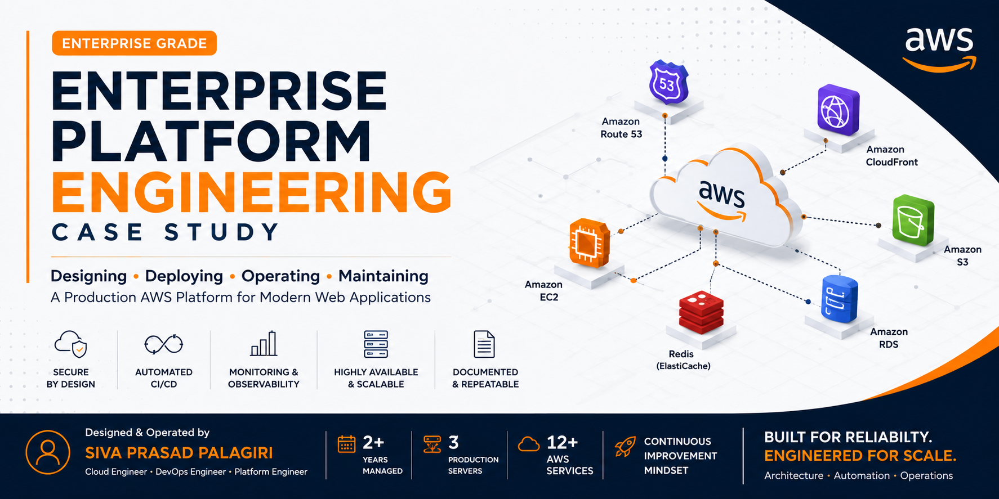
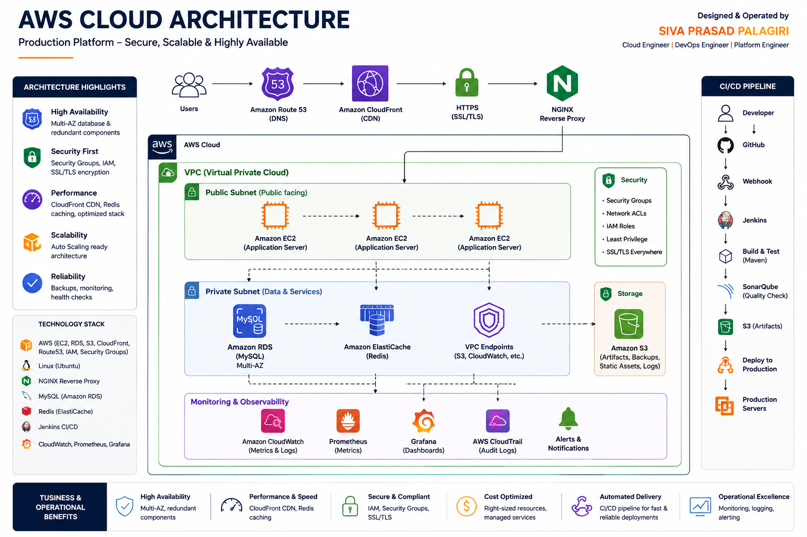
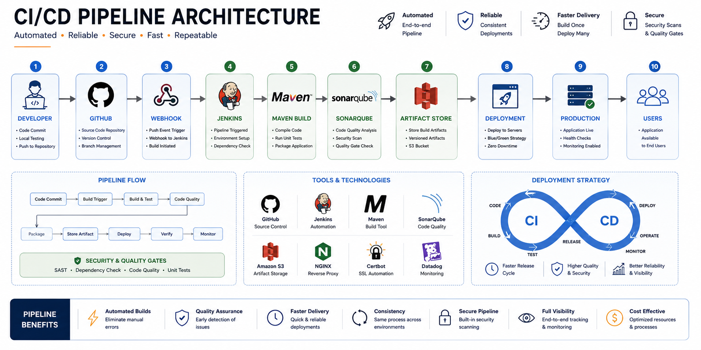
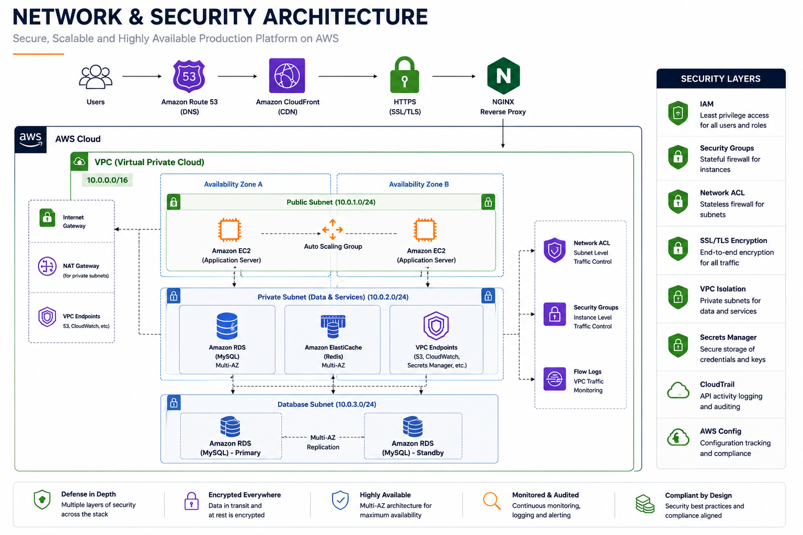
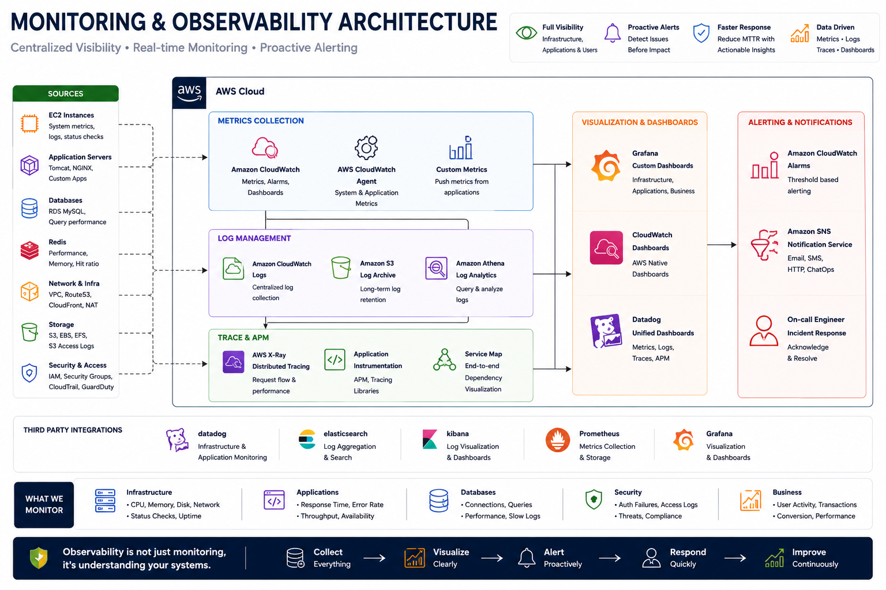

<a id="top"></a>

<p align="center">



</p>

<h1 align="center">
Enterprise Platform Engineering Case Study
</h1>

<p align="center">

<b>Designing • Deploying • Operating • Securing • Continuously Improving Production AWS Platforms</b>

</p>

<p align="center">


</p>

<p align="center">


</p>

---

<p align="center">

Production-grade AWS Platform Engineering case study demonstrating cloud architecture, infrastructure automation, CI/CD pipelines, Linux administration, networking, monitoring, security, documentation, and production operations based on real enterprise experience.

</p>

---

## 📑 Navigation

<p align="center">

<a href="#-executive-summary">📖 <b>Summary</b></a> •
<a href="#-project-snapshot">📊 <b>Metrics</b></a> •
<a href="#-production-aws-architecture">☁️ <b>Architecture</b></a> •
<a href="#-engineering-highlights">⚙️ <b>Engineering</b></a> •
<a href="#️-technology-stack">🛠️ <b>Tech Stack</b></a>

</p>

<p align="center">

<a href="#-technical-documentation">📚 <b>Documentation</b></a> •
<a href="#-repository-structure">📂 <b>Repository</b></a> •
<a href="#️-engineering-gallery">🖼️ <b>Gallery</b></a> •
<a href="#-production-engineering-timeline">📈 <b>Timeline</b></a>

</p>

<p align="center">

<a href="#-live-production-platform">🌍 <b>Live Platform</b></a> •
<a href="#-future-roadmap">🚀 <b>Roadmap</b></a> •
<a href="#author">👨‍💻 <b>Author</b></a> •
<a href="#️-disclaimer">⚖️ <b>Disclaimer</b></a>

</p>

---

# 📖 Executive Summary

This repository documents a **production-grade AWS Platform Engineering case study** based on my experience as the **sole Cloud & DevOps Engineer** responsible for designing, deploying, securing, automating, monitoring, documenting, and operating a live enterprise cloud platform for nearly two years.

Unlike tutorial-based projects or laboratory demonstrations, this repository represents practical engineering work performed in a real production environment supporting business-critical applications and services.

Throughout this engagement, I was responsible for the complete operational lifecycle of the platform, including:

- ☁️ Designing AWS cloud infrastructure
- 🚀 Building and maintaining CI/CD pipelines
- 🔒 Implementing infrastructure security and access control
- 🌐 Managing networking, DNS, reverse proxy, and SSL/TLS
- 🐧 Administering Linux production servers
- 📊 Monitoring infrastructure and application health
- 🛠️ Supporting production deployments and incident response
- 📚 Producing comprehensive technical documentation
- ⚙️ Continuously improving platform reliability and operational efficiency

This repository intentionally excludes proprietary source code, customer information, credentials, internal IP addresses, and confidential business assets. All technical documentation, diagrams, and examples have been carefully sanitized while preserving the engineering decisions, architectural principles, and operational practices used throughout the project.

The objective of this repository is to demonstrate **how I approach Platform Engineering**—combining cloud architecture, DevOps automation, infrastructure operations, security, observability, and documentation to build and maintain reliable production platforms.

> **Engineering is not only about deploying infrastructure—it is about taking ownership of the entire platform lifecycle.**

<p align="right">

<a href="#top">⬆️ Back to Top</a>

</p>

---

# 📊 Project Snapshot

<table>
<tr>
<td align="center" width="25%">

### ☁️ Platform

**Enterprise Production**

AWS Cloud Infrastructure

</td>

<td align="center" width="25%">

### 👨‍💻 Role

**Cloud & DevOps Engineer**

End-to-End Platform Ownership

</td>

<td align="center" width="25%">

### 📅 Experience

**~2 Years**

Production Operations

</td>

<td align="center" width="25%">

### 🚀 Status

**Live Production**

Business-Critical Platform

</td>
</tr>
</table>

---

## 📈 Engineering Metrics

| Category | Details |
|-----------|---------|
| ☁️ Cloud Provider | Amazon Web Services (AWS) |
| 🖥️ Production Servers | 3 |
| 🌍 Environments Managed | Production & Testing |
| ⚙️ CI/CD Pipelines | Jenkins Automated Deployments |
| 📦 Deployment Strategy | Automated Continuous Delivery |
| 🗄️ Database | Amazon RDS (MySQL) |
| 📂 Object Storage | Amazon S3 |
| 🌐 DNS Management | Amazon Route53 |
| 🚀 Content Delivery | Amazon CloudFront |
| 🔐 Security | IAM, Security Groups, SSL/TLS |
| 📊 Monitoring | Datadog, ELK, Prometheus, Grafana |
| 📚 Technical Documentation | 300+ Pages |
| 🛠️ Platform Ownership | End-to-End |
| 📖 Repository Type | Engineering Case Study |

---

## 🎯 Key Highlights

- ✅ Production-grade AWS cloud platform
- ✅ Sole Cloud & DevOps Engineer responsible for platform operations
- ✅ Automated CI/CD pipelines using Jenkins
- ✅ Secure networking with Route53, CloudFront, NGINX, and SSL/TLS
- ✅ Linux server administration and production support
- ✅ Infrastructure monitoring and observability
- ✅ Technical documentation and operational runbooks
- ✅ Continuous platform improvements and operational excellence

> **This repository represents practical production engineering experience rather than a tutorial or laboratory exercise.**

<p align="right">

<a href="#top">⬆️ Back to Top</a>

</p>

---

# ☁️ Production AWS Architecture

The following architecture represents a **production-grade AWS platform** that I designed, deployed, operated, and continuously maintained as the sole Cloud & DevOps Engineer.

The platform was designed with a strong focus on **high availability, security, scalability, operational simplicity, and maintainability**, supporting live business applications in a production environment.

Rather than exposing proprietary implementation details, the diagram below illustrates the overall architectural approach and the interaction between the core infrastructure components.

<p align="center">



</p>

---

## 🏗️ High-Level Architecture Overview

The platform follows a layered architecture to separate responsibilities and improve security, scalability, and operational efficiency.

```
                    Internet
                         │
                         ▼
                  Amazon Route53
                         │
                         ▼
                Amazon CloudFront
                         │
                         ▼
                 NGINX Reverse Proxy
                         │
        ┌────────────────┼────────────────┐
        ▼                ▼                ▼
 Application        Internal APIs      Services
        │
        ▼
 Amazon RDS (MySQL)
        │
        ▼
     Redis Cache
```

---

## 🧩 Core Infrastructure Components

| Layer | Services |
|--------|----------|
| 🌍 DNS | Amazon Route53 |
| 🚀 CDN | Amazon CloudFront |
| 🌐 Reverse Proxy | NGINX |
| ☁️ Compute | Amazon EC2 |
| 🗄️ Database | Amazon RDS (MySQL) |
| 📂 Object Storage | Amazon S3 |
| ⚡ Cache | Redis |
| 🔐 Security | IAM, Security Groups, SSL/TLS |
| 📊 Monitoring | Datadog, ELK Stack, Prometheus, Grafana |

---

## 🎯 Architecture Design Principles

The infrastructure was designed around several key engineering principles:

### 🔹 Security by Design

- HTTPS for all public endpoints
- IAM-based access control
- Least privilege permissions
- Security Group isolation
- Private database access
- SSL/TLS encryption

---

### 🔹 High Availability

The platform was designed to minimize downtime by using:

- Multiple production application servers
- Reverse proxy traffic routing
- CloudFront content delivery
- Managed AWS services
- Health verification after deployments

---

### 🔹 Scalability

The architecture supports future growth through:

- Independent application services
- Managed database services
- CDN-based content delivery
- Stateless application deployments
- Modular infrastructure design

---

### 🔹 Operational Excellence

Operational simplicity was achieved through:

- Standardized deployment procedures
- Automated CI/CD pipelines
- Centralized documentation
- Infrastructure monitoring
- Production validation checklists
- Incident response processes

---

## 🔄 Production Request Flow

A typical client request follows this path:

```
User Browser

        │
        ▼

Amazon Route53

        │
        ▼

Amazon CloudFront

        │
        ▼

NGINX Reverse Proxy

        │
        ▼

Application Server

        │
        ▼

Amazon RDS / Redis

        │
        ▼

Response Returned to User
```

This layered approach improves security, simplifies traffic management, and enhances platform performance while keeping backend services isolated from direct public access.

---

## 💡 Key Engineering Decisions

Some of the major architectural decisions made during the platform lifecycle included:

- Separating production and testing environments
- Using managed AWS services where appropriate
- Centralizing traffic management with NGINX
- Automating deployments through Jenkins
- Maintaining infrastructure documentation
- Monitoring application and infrastructure health
- Applying the principle of least privilege
- Reducing manual operational tasks through automation

These decisions helped improve reliability, simplify maintenance, and support long-term platform growth.

---

## 📌 Key Takeaways

This architecture demonstrates practical experience across multiple engineering disciplines, including:

- Cloud Architecture
- AWS Infrastructure
- DevOps Automation
- Linux Administration
- Infrastructure Security
- DNS & Networking
- Reverse Proxy Configuration
- Database Management
- Monitoring & Observability
- Production Operations

Rather than focusing on individual AWS services, the architecture illustrates how these components work together to support a secure, scalable, and maintainable production platform.

<p align="right">

<a href="#top">⬆️ Back to Top</a>

</p>

---

# ⚙️ Engineering Highlights

This repository showcases practical engineering experience gained while designing, deploying, securing, automating, monitoring, and operating a production AWS platform.

Rather than focusing on individual technologies, this case study demonstrates how multiple engineering disciplines were combined to build and maintain a reliable production environment.

---

## ☁️ Cloud Architecture

Designed and maintained scalable AWS infrastructure supporting production workloads with an emphasis on reliability, security, and operational simplicity.

**Key Responsibilities**

- AWS infrastructure design
- Production environment management
- High-level architecture planning
- Cloud resource optimization
- Infrastructure documentation

---

## 🚀 DevOps & CI/CD

Designed and maintained automated deployment pipelines that reduced manual effort and improved deployment consistency.

**Key Responsibilities**

- Jenkins Pipeline Automation
- Maven Build Process
- Deployment Automation
- Continuous Integration
- Continuous Delivery
- Release Validation

---

## 🌐 Networking & Infrastructure

Configured and managed production networking components responsible for secure application delivery and traffic management.

**Key Responsibilities**

- Amazon Route53
- Amazon CloudFront
- NGINX Reverse Proxy
- DNS Management
- HTTPS Configuration
- SSL/TLS Management
- Traffic Routing

---

## 🔐 Security & Compliance

Implemented infrastructure security following cloud security best practices to protect production workloads and business assets.

**Key Responsibilities**

- AWS IAM
- Security Groups
- Least Privilege Access
- SSL/TLS Encryption
- Secure Infrastructure Design
- Access Management

---

## 🐧 Linux Administration

Managed Linux production servers responsible for hosting enterprise applications and supporting deployment operations.

**Key Responsibilities**

- Ubuntu Server Administration
- System Monitoring
- Service Management
- Performance Optimization
- Process Management
- Log Analysis
- Troubleshooting

---

## 📊 Monitoring & Observability

Implemented monitoring solutions that provided visibility into infrastructure health, application performance, and operational stability.

**Key Responsibilities**

- Datadog Monitoring
- Prometheus Metrics
- Grafana Dashboards
- ELK Stack
- Log Management
- Alerting
- Health Monitoring

---

## 📦 Production Operations

Maintained day-to-day production operations while ensuring platform stability and minimizing service interruptions.

**Key Responsibilities**

- Production Deployments
- Incident Response
- Infrastructure Maintenance
- Operational Documentation
- Change Management
- Root Cause Analysis
- Continuous Improvement

---

## 📚 Technical Documentation

Produced detailed engineering documentation to improve operational consistency, knowledge sharing, and long-term maintainability.

**Documentation Included**

- Cloud Architecture
- Infrastructure Design
- CI/CD Pipelines
- Network Security
- Production Operations
- Monitoring
- Engineering Decisions
- Lessons Learned

---

## 💡 Core Engineering Principles

The engineering decisions throughout this project were guided by the following principles:

- Reliability over Complexity
- Automation First
- Security by Design
- Infrastructure as a Product
- Documentation as Code
- Operational Excellence
- Continuous Improvement
- End-to-End Ownership

---

## 🎯 Engineering Outcome

This repository demonstrates practical experience across the complete lifecycle of a production platform, including:

- Architecture Design
- Infrastructure Provisioning
- Automation
- Deployment
- Security
- Monitoring
- Operations
- Documentation
- Continuous Improvement

Rather than focusing solely on technology, this case study reflects an engineering mindset centered on building secure, scalable, maintainable, and reliable cloud platforms.

<p align="right">

<a href="#top">⬆️ Back to Top</a>

</p>

---

# 🛠️ Technology Stack

The production platform was built using a modern cloud-native technology stack focused on reliability, automation, security, scalability, and operational excellence.

---

## ☁️ Cloud Platform

| Technology | Purpose |
|------------|---------|
| Amazon EC2 | Hosted production application servers |
| Amazon RDS (MySQL) | Managed relational database service |
| Amazon S3 | Artifact storage, backups, and static assets |
| Amazon Route53 | DNS management and domain routing |
| Amazon CloudFront | Global CDN for faster content delivery |
| AWS IAM | Identity and access management |
| Security Groups | Network-level access control |

---

## 🚀 DevOps & Automation

| Technology | Purpose |
|------------|---------|
| Jenkins | CI/CD pipeline automation |
| Git & GitHub | Source code version control |
| Maven | Java application build automation |
| Shell Scripting | Deployment and server automation |

---

## 🌐 Networking

| Technology | Purpose |
|------------|---------|
| NGINX | Reverse proxy and request routing |
| Route53 | DNS management |
| CloudFront | Content delivery and caching |
| SSL/TLS | Secure HTTPS communication |
| Certbot | SSL certificate management |

---

## 🐧 Operating System

| Technology | Purpose |
|------------|---------|
| Ubuntu Linux | Production server operating system |
| Bash | System administration and automation |
| Systemd | Linux service management |

---

## 🗄️ Database & Storage

| Technology | Purpose |
|------------|---------|
| Amazon RDS | Managed MySQL database |
| MySQL | Relational database engine |
| Redis | In-memory caching layer |
| Amazon S3 | Object storage |

---

## 📊 Monitoring & Observability

| Technology | Purpose |
|------------|---------|
| Datadog | Infrastructure and application monitoring |
| Prometheus | Metrics collection |
| Grafana | Dashboard visualization |
| ELK Stack | Centralized logging and analysis |

---

## 🔐 Security

| Technology | Purpose |
|------------|---------|
| IAM | Role-based access control |
| Security Groups | Firewall rules |
| SSL/TLS | Secure encrypted communication |
| HTTPS | Secure public access |
| Least Privilege | Access management strategy |

---

## 📚 Documentation

| Technology | Purpose |
|------------|---------|
| Markdown | Technical documentation |
| Draw.io | Architecture diagrams |
| GitHub | Documentation version control |

---

## 💡 Engineering Philosophy

Rather than selecting technologies for their popularity, each component was chosen to solve a specific operational challenge.

The overall technology stack emphasizes:

- Reliability
- Security
- Automation
- Maintainability
- Scalability
- Operational Simplicity
- Continuous Improvement

Every technology included in this repository played a role in supporting a live production platform and was selected based on practical engineering requirements.

<p align="right">

<a href="#top">⬆️ Back to Top</a>

</p>

---

# 📚 Technical Documentation

Comprehensive engineering documentation was created throughout the lifecycle of the project to standardize operations, simplify maintenance, improve knowledge sharing, and support long-term platform reliability.

Unlike traditional project documentation, each document in this repository focuses on a specific aspect of the production platform and reflects practical engineering decisions made during real-world operations.

---

## 📖 Documentation Library

| Document | Description |
|-----------|-------------|
| 📘 **[01 - Project Overview](docs/01-project-overview.md)** | Business objectives, project scope, engineering responsibilities, platform overview, and key outcomes. |
| ☁️ **[02 - Cloud Architecture](docs/02-cloud-architecture.md)** | Production AWS architecture, infrastructure components, design decisions, request flow, and architectural principles. |
| ⚙️ **[03 - CI/CD Pipeline](docs/03-cicd-pipeline.md)** | Jenkins pipeline design, deployment workflow, build automation, release strategy, and deployment process. |
| 🔒 **[04 - Network & Security](docs/04-network-security.md)** | Networking architecture, Route53, CloudFront, NGINX, IAM, Security Groups, SSL/TLS, and security best practices. |
| 📊 **[05 - Monitoring & Observability](docs/05-monitoring-observability.md)** | Infrastructure monitoring, application health, centralized logging, dashboards, alerting, and operational visibility. |
| 🛠️ **[06 - Production Operations](docs/06-operations.md)** | Daily operational responsibilities, production support, incident response, maintenance, and platform administration. |
| 💡 **[07 - Lessons Learned](docs/07-lessons-learned.md)** | Engineering insights, operational best practices, architecture decisions, and continuous improvement throughout the project. |

---

## 🎯 Documentation Objectives

The documentation was created to achieve the following engineering goals:

- Standardize production operations
- Document cloud architecture decisions
- Improve deployment consistency
- Simplify infrastructure maintenance
- Support operational excellence
- Accelerate onboarding and knowledge transfer
- Improve troubleshooting efficiency
- Preserve engineering knowledge
- Reduce operational risk
- Enable continuous improvement

---

## 📚 Documentation Categories

### ☁️ Architecture Documentation

- Production Infrastructure
- AWS Services
- Platform Design
- Infrastructure Components
- Request Flow
- Design Decisions

---

### ⚙️ Deployment Documentation

- Jenkins Pipelines
- CI/CD Workflow
- Release Process
- Deployment Validation
- Rollback Strategy

---

### 🔐 Security Documentation

- IAM Strategy
- Security Groups
- SSL/TLS
- HTTPS Configuration
- Network Security
- Access Control

---

### 📊 Operations Documentation

- Monitoring
- Incident Response
- Maintenance Procedures
- Health Checks
- Production Support
- Troubleshooting

---

### 📖 Knowledge Base

- Engineering Decisions
- Operational Lessons
- Best Practices
- Future Improvements
- Platform Evolution

---

## 💡 Documentation Philosophy

Documentation was treated as an essential engineering deliverable rather than an afterthought.

Every significant infrastructure change, deployment process, operational procedure, and architectural decision was documented to improve maintainability, reduce operational complexity, and support long-term platform ownership.

Well-maintained documentation enables engineers to understand **why** a system was built—not just **how** it works.

---

## 📌 Repository Navigation

```
docs/
│
├── 📘 01-project-overview.md
├── ☁️ 02-cloud-architecture.md
├── ⚙️ 03-cicd-pipeline.md
├── 🔒 04-network-security.md
├── 📊 05-monitoring-observability.md
├── 🛠️ 06-operations.md
└── 💡 07-lessons-learned.md
```

Each document can be read independently while also contributing to the complete engineering story of the production platform.

<p align="right">

<a href="#top">⬆️ Back to Top</a>

</p>

---

# 📂 Repository Structure

The repository follows a structured and modular layout to separate documentation, architecture diagrams, visual assets, and supporting resources.

The organization is designed to make the repository easy to navigate, maintain, and extend as additional engineering case studies are added in the future.

---

## 📁 Project Directory

```text
enterprise-platform-engineering-case-study
│
├── 📄 README.md
│
├── 📂 docs
│   ├── 📘 01-project-overview.md
│   ├── ☁️ 02-cloud-architecture.md
│   ├── ⚙️ 03-cicd-pipeline.md
│   ├── 🔒 04-network-security.md
│   ├── 📊 05-monitoring-observability.md
│   ├── 🛠️ 06-operations.md
│   └── 💡 07-lessons-learned.md
│
├── 📂 assets
│   ├── 📂 images
│   │   ├── repository-banner.png
│   │   ├── aws-architecture.png
│   │   ├── cicd-pipeline.png
│   │   ├── network-security.png
│   │   ├── monitoring.png
│   │   └── social-preview.jpg
│   │
│   ├── 📂 icons
│   │
│   └── 📂 diagrams
│
├── 📂 diagrams
│
├── 📄 LICENSE
│
└── 📄 .gitignore
```

---

# 📦 Repository Organization

| Directory | Purpose |
|------------|---------|
| 📄 README.md | Primary project documentation and navigation |
| 📂 docs | Detailed engineering documentation |
| 📂 assets/images | Repository images, architecture diagrams, banners, and screenshots |
| 📂 assets/icons | Custom icons and visual assets |
| 📂 assets/diagrams | Editable architecture source files (Draw.io, SVG, etc.) |
| 📂 diagrams | Additional exported architecture and workflow diagrams |
| 📄 LICENSE | Open-source license information |
| 📄 .gitignore | Git repository configuration |

---

# 🎯 Repository Design Principles

The repository structure follows several engineering principles:

### 📚 Documentation First

All technical documentation is maintained separately from visual assets, making it easier to navigate and update.

---

### 🖼️ Visual Assets

Architecture diagrams, workflow diagrams, banners, and repository graphics are grouped under a dedicated assets directory for consistent organization.

---

### 🧩 Modular Design

Each engineering topic is documented independently, allowing readers to explore individual subjects without reading the repository sequentially.

---

### 🔄 Maintainability

The directory structure is intentionally simple and scalable, making it straightforward to add future documentation, diagrams, or engineering case studies.

---

# 🚀 Repository Navigation Flow

```text
README.md
      │
      ▼

Executive Summary
      │
      ▼

AWS Architecture
      │
      ▼

Engineering Highlights
      │
      ▼

Technology Stack
      │
      ▼

Technical Documentation
      │
      ▼

Individual Engineering Documents
      │
      ▼

Lessons Learned
```

This navigation flow enables readers to quickly understand the platform at a high level before exploring the detailed engineering documentation.

---

# 💡 Engineering Philosophy

The repository is organized using the same principles applied to production systems:

- Keep components modular
- Separate concerns
- Maintain clear documentation
- Organize assets logically
- Design for long-term maintainability
- Make navigation intuitive

A well-structured repository reflects the same engineering discipline expected when designing and operating production platforms.

<p align="right">

<a href="#top">⬆️ Back to Top</a>

</p>

---

# 🖼️ Engineering Gallery

This gallery provides a visual overview of the production platform, highlighting the core architectural components, deployment workflow, network design, and monitoring strategy.

Each diagram represents a different aspect of the platform and complements the detailed technical documentation available in the `docs/` directory.

---

## ☁️ Production AWS Architecture

The overall infrastructure design illustrating the interaction between AWS services, networking components, application servers, databases, and supporting services.

<p align="center">


</p>

---

## 🚀 CI/CD Pipeline

Automated deployment workflow demonstrating how application code progresses from source control to production through Jenkins CI/CD.

<p align="center">



</p>

---

## 🔐 Network & Security Architecture

Network topology showing secure traffic flow, DNS routing, reverse proxy, SSL termination, and communication between infrastructure components.

<p align="center">



</p>

---

## 📊 Monitoring & Observability

Monitoring architecture illustrating infrastructure metrics, application monitoring, centralized logging, dashboards, and operational alerting.

<p align="center">



</p>

---

# 📚 Engineering Documentation

Every diagram in this gallery is supported by detailed technical documentation.

| Diagram | Documentation |
|---------|---------------|
| ☁️ AWS Architecture | `docs/02-cloud-architecture.md` |
| 🚀 CI/CD Pipeline | `docs/03-cicd-pipeline.md` |
| 🔐 Network & Security | `docs/04-network-security.md` |
| 📊 Monitoring | `docs/05-monitoring-observability.md` |

---

# 🎯 Purpose of the Gallery

The Engineering Gallery enables readers to quickly understand the overall platform before exploring the detailed engineering documentation.

It demonstrates:

- Cloud Architecture
- Platform Engineering
- CI/CD Automation
- Infrastructure Security
- Network Design
- Monitoring & Observability
- Production Operations

The diagrams have been intentionally simplified and sanitized to protect proprietary infrastructure while accurately representing the engineering approach used throughout the project.

---

# 💡 Engineering Philosophy

Good architecture should be easy to understand.

Each diagram in this repository was designed with the same principles used when building production systems:

- Simplicity
- Clarity
- Maintainability
- Scalability
- Security
- Operational Excellence

Rather than focusing on visual complexity, the diagrams communicate the architectural decisions and operational workflows that supported a reliable production environment.

<p align="right">

<a href="#top">⬆️ Back to Top</a>

</p>

---

# 📈 Production Engineering Timeline

The platform evolved through a structured engineering lifecycle, beginning with business requirements and progressing through architecture, automation, deployment, production operations, and continuous improvement.

This timeline illustrates the engineering journey followed while building and operating the production platform.

---

## 🚀 Engineering Lifecycle

```text
Business Requirements
        │
        ▼
Cloud Architecture Design
        │
        ▼
AWS Infrastructure Provisioning
        │
        ▼
Network & Security Configuration
        │
        ▼
CI/CD Pipeline Automation
        │
        ▼
Application Deployment
        │
        ▼
Production Validation
        │
        ▼
Monitoring & Observability
        │
        ▼
Production Operations
        │
        ▼
Incident Response
        │
        ▼
Continuous Platform Improvements
```

---

## 📅 Engineering Journey

| Phase | Activities | Outcome |
|--------|------------|---------|
| 🎯 Requirements | Understand business needs and platform objectives | Engineering roadmap established |
| ☁️ Cloud Architecture | Design AWS infrastructure and application topology | Scalable cloud architecture |
| 🏗️ Infrastructure | Provision AWS services and production environments | Production-ready infrastructure |
| 🔐 Security | Configure IAM, Security Groups, SSL/TLS, DNS, and networking | Secure platform foundation |
| ⚙️ DevOps | Build Jenkins CI/CD pipelines and deployment automation | Reliable software delivery |
| 🚀 Deployment | Deploy applications to production infrastructure | Live production environment |
| 📊 Observability | Implement monitoring, dashboards, centralized logging, and alerts | Operational visibility |
| 🛠️ Operations | Perform maintenance, troubleshooting, upgrades, and support | Stable production platform |
| 📚 Documentation | Create architecture guides, runbooks, and operational documentation | Long-term maintainability |
| 📈 Continuous Improvement | Optimize reliability, performance, security, and operational efficiency | Platform maturity |

---

## 🔄 Continuous Engineering Cycle

Production engineering is an ongoing process rather than a one-time deployment.

```text
Plan
   │
   ▼
Design
   │
   ▼
Build
   │
   ▼
Deploy
   │
   ▼
Operate
   │
   ▼
Monitor
   │
   ▼
Improve
   │
   └───────────────────────────────┐
                                   │
                                   ▼
                             Repeat Cycle
```

Each iteration focused on increasing platform reliability, simplifying operations, improving security, and enhancing deployment consistency.

---

## 🎯 Key Engineering Milestones

During the project, the platform matured through several significant milestones:

- ✅ Designed a production-grade AWS architecture
- ✅ Established separate Production and Testing environments
- ✅ Automated software delivery using Jenkins CI/CD
- ✅ Secured infrastructure with IAM, Security Groups, and SSL/TLS
- ✅ Implemented centralized monitoring and observability
- ✅ Standardized deployment procedures and operational runbooks
- ✅ Reduced manual operational effort through automation
- ✅ Produced comprehensive engineering documentation
- ✅ Supported a live production environment with continuous operational improvements

---

## 💡 Engineering Philosophy

This timeline reflects a fundamental principle of Platform Engineering:

> **A successful platform is not defined by its initial deployment, but by how effectively it can be operated, maintained, monitored, secured, and continuously improved over time.**

Every phase contributed to building a production platform that was reliable, maintainable, scalable, and aligned with business objectives.

<p align="right">

<a href="#top">⬆️ Back to Top</a>

</p>

---

# 🌍 Live Production Platform

The engineering practices, architecture, automation, and operational workflows documented in this repository were applied to a **live production platform** serving real users.

The application remains publicly accessible and demonstrates the long-term operational stability of the infrastructure and platform engineering practices described throughout this case study.

---

## 🚀 Production Website

<p align="center">

### 🔗 https://www.getrightproperty.com

</p>

---

## 📋 Platform Overview

| Category | Details |
|----------|---------|
| 🌐 Platform Type | Real Estate Platform |
| ☁️ Cloud Infrastructure | Amazon Web Services (AWS) |
| 🚀 Deployment Model | Automated CI/CD using Jenkins |
| 🐧 Operating System | Ubuntu Linux |
| 🌍 Availability | Public Production Website |
| 🔐 Security | HTTPS with SSL/TLS |
| 📊 Operations | Continuous Monitoring & Production Support |

---

## 💼 My Engineering Responsibilities

As the Cloud & DevOps Engineer supporting this platform, my responsibilities included:

- ☁️ Designing and maintaining AWS infrastructure
- 🚀 Building and maintaining Jenkins CI/CD pipelines
- 🐧 Administering Linux production servers
- 🌐 Managing DNS, CloudFront, Route53, and NGINX
- 🔒 Implementing SSL/TLS and infrastructure security
- 📦 Managing application deployments
- 📊 Monitoring platform health and operational stability
- 🛠️ Troubleshooting production issues
- 📚 Maintaining technical documentation
- 📈 Continuously improving platform reliability and operational efficiency

---

## ⚠️ Repository Scope

To protect customer privacy and confidential business information, this repository intentionally excludes:

- Proprietary application source code
- Business logic
- Customer data
- Internal IP addresses
- Infrastructure credentials
- Deployment secrets
- Production configuration files
- Internal operational procedures

The focus of this repository is on the engineering practices, architectural decisions, automation strategies, and operational ownership that supported the production platform.

---

## 🎯 Engineering Value

This case study demonstrates practical experience in:

- Production Cloud Engineering
- AWS Infrastructure
- Platform Engineering
- DevOps Automation
- Infrastructure Security
- Linux Administration
- Production Operations
- Monitoring & Observability
- Technical Documentation
- Continuous Improvement

Rather than demonstrating isolated technical skills, this repository illustrates how multiple engineering disciplines were combined to successfully operate and continuously improve a real-world production platform.

> **Production engineering is measured not only by successful deployments, but by the ability to keep systems secure, reliable, maintainable, and continuously improving over time.**

<p align="right">

<a href="#top">⬆️ Back to Top</a>

</p>

---

# 🚀 Future Roadmap

Although the platform successfully supports a live production environment, modern cloud technologies continue to evolve. If I were designing the next generation of this platform today, I would focus on increasing automation, scalability, observability, resilience, and operational efficiency.

The roadmap below outlines the logical evolution of the platform based on current Platform Engineering and Cloud Native best practices.

---

# 🗺️ Platform Evolution Roadmap

| Phase | Initiative | Engineering Value |
|--------|------------|-------------------|
| 🏗️ Phase 1 | Infrastructure as Code (Terraform) | Eliminate manual provisioning and improve infrastructure consistency |
| 🐳 Phase 2 | Containerization (Docker) | Standardize application packaging and deployment |
| ☸️ Phase 3 | Kubernetes Platform | Improve scalability, resilience, and workload orchestration |
| 🔄 Phase 4 | GitOps (Argo CD) | Declarative deployments and automated configuration management |
| 📊 Phase 5 | OpenTelemetry | Unified metrics, logs, and distributed tracing |
| 🔐 Phase 6 | DevSecOps | Integrate automated security scanning into CI/CD pipelines |
| 💰 Phase 7 | FinOps | Cloud cost optimization and resource governance |
| 🤖 Phase 8 | AIOps | AI-assisted monitoring, anomaly detection, and predictive operations |

---

# 📈 Engineering Roadmap

```text
Current Production Platform
            │
            ▼
Infrastructure as Code
            │
            ▼
Containerized Applications
            │
            ▼
Kubernetes Platform
            │
            ▼
GitOps Automation
            │
            ▼
Advanced Observability
            │
            ▼
DevSecOps
            │
            ▼
FinOps
            │
            ▼
AIOps
```

---

# 🎯 Future Engineering Initiatives

## 🏗️ Infrastructure as Code

Replace manual infrastructure provisioning with Terraform to achieve:

- Repeatable deployments
- Version-controlled infrastructure
- Disaster recovery readiness
- Faster environment provisioning

---

## 🐳 Containerization

Package applications using Docker to provide:

- Consistent deployments
- Environment portability
- Simplified release management
- Better scalability

---

## ☸️ Kubernetes Platform

Adopt Kubernetes for production orchestration to enable:

- Self-healing workloads
- Horizontal scaling
- Rolling deployments
- High availability
- Resource optimization

---

## 🔄 GitOps

Implement GitOps workflows using Argo CD to achieve:

- Declarative infrastructure
- Automated synchronization
- Rollback capabilities
- Configuration consistency

---

## 📊 Observability

Expand monitoring beyond traditional infrastructure metrics by introducing:

- Distributed tracing
- Application Performance Monitoring (APM)
- Service dependency mapping
- SLO and SLA reporting
- Capacity planning dashboards

---

## 🔐 DevSecOps

Integrate security directly into the engineering workflow through:

- Static code analysis
- Dependency vulnerability scanning
- Infrastructure security validation
- Container image scanning
- Policy-as-Code

---

## 💰 FinOps

Improve cloud resource efficiency by implementing:

- Cost visibility dashboards
- Budget monitoring
- Rightsizing recommendations
- Resource lifecycle management
- Reserved Instance planning

---

## 🤖 AIOps

Leverage Artificial Intelligence to enhance platform operations through:

- Intelligent alert correlation
- Predictive failure detection
- Automated incident analysis
- Capacity forecasting
- Operational recommendations

---

# 💡 Long-Term Vision

The long-term objective is to evolve from a traditionally managed cloud infrastructure into a **fully automated Platform Engineering ecosystem** built on modern cloud-native principles.

This evolution emphasizes:

- Automation over manual operations
- Self-service infrastructure
- Infrastructure as Code
- Continuous Delivery
- Security by Default
- Observability by Design
- Intelligent Operations
- Continuous Improvement

Rather than simply adopting new technologies, each initiative is intended to solve a specific operational challenge while improving platform reliability, developer productivity, and business agility.

> **Great platforms are never truly finished—they continuously evolve alongside technology, operational needs, and business goals.**

<p align="right">

<a href="#top">⬆️ Back to Top</a>

</p>

---
<a id="author"></a>

# 👨‍💻 About the Author

<p align="center">


<!-- 

 -->

</p>

## Siva Prasad Palagiri

**Cloud Engineer • DevOps Engineer • Platform Engineer**

Founder — **CloudOps Velocity**

---

## 🚀 Professional Summary

I am a Cloud & DevOps Engineer with hands-on experience designing, deploying, automating, securing, monitoring, and operating production workloads on Amazon Web Services (AWS).

My experience spans the complete infrastructure lifecycle—from cloud architecture and CI/CD automation to Linux administration, networking, monitoring, production operations, and technical documentation.

I enjoy building reliable platforms that reduce operational complexity through automation while improving security, scalability, and maintainability.

Rather than focusing on individual technologies, I focus on building systems that are resilient, observable, and easy to operate.

---

## 🎯 Areas of Expertise

- ☁️ AWS Cloud Infrastructure
- 🚀 DevOps & CI/CD Automation
- ⚙️ Platform Engineering
- 🐧 Linux System Administration
- 🌐 Networking & DNS
- 🔐 Infrastructure Security
- 📊 Monitoring & Observability
- 📚 Technical Documentation
- 🛠️ Production Operations
- 📈 Continuous Improvement

---

## 🧰 Core Technologies

AWS • Jenkins • Linux • NGINX • Route53 • CloudFront • EC2 • Amazon RDS • Amazon S3 • MySQL • Redis • Datadog • Prometheus • Grafana • ELK Stack • Git • GitHub • Maven • Bash

---

## 🌱 Currently Learning

As cloud technologies continue to evolve, I am actively expanding my expertise in:

- Terraform (Infrastructure as Code)
- Docker
- Kubernetes
- GitOps
- Argo CD
- OpenTelemetry
- AI Infrastructure
- MLOps
- Platform Engineering

---

## 🌍 Connect With Me

<p align="center">

<a href="https://cloudopsvelocity.com">🌐 Website</a> •
<a href="https://www.linkedin.com/in/sivaprasad-palagiri">💼 LinkedIn</a> •
<a href="https://github.com/Siva-Prasad-Palagiri">💻 GitHub</a>

</p>

---

## 💡 Engineering Philosophy

> **"Great platforms are not measured by how quickly they are built, but by how reliably they operate, how securely they are maintained, and how easily they can evolve."**

I believe Platform Engineering is about enabling teams through automation, standardization, and operational excellence—not simply deploying infrastructure.

My long-term goal is to build cloud platforms that empower businesses to innovate faster while maintaining high standards of security, reliability, and operational efficiency.

<p align="right">

<a href="#top">⬆️ Back to Top</a>

</p>

---

# ⚖️ Disclaimer

This repository is a **sanitized engineering case study** created for educational, professional, and portfolio purposes.

The objective of this repository is to demonstrate practical experience in **Cloud Engineering, DevOps, Platform Engineering, AWS Infrastructure, CI/CD Automation, Production Operations, Infrastructure Security, Monitoring, and Technical Documentation** through a real-world production engagement.

To protect confidentiality and respect intellectual property, the following have **not** been included in this repository:

- Proprietary application source code
- Customer information or personal data
- Internal IP addresses and network topology
- Infrastructure credentials or secrets
- Business logic and application-specific implementations
- Production configuration files
- Deployment secrets or certificates
- Internal operational procedures
- Confidential company documentation

All architecture diagrams, deployment workflows, documentation, and engineering examples have been intentionally simplified and sanitized while preserving the technical concepts, engineering decisions, and operational practices demonstrated throughout the project.

The production website referenced in this repository is included solely to illustrate that the engineering practices described were applied to a live production environment. This repository should not be interpreted as ownership of the application or its intellectual property.

The opinions, documentation, engineering approaches, and future roadmap presented in this repository are my own and are intended to showcase my professional experience, engineering methodology, and continuous learning journey.

---

## 📜 Copyright Notice

© 2026 Siva Prasad Palagiri.

This documentation, repository structure, architecture diagrams, written content, and original engineering documentation are provided under the terms of the MIT License unless otherwise stated.

Third-party trademarks, product names, company names, and service names referenced in this repository remain the property of their respective owners.

---

## 🤝 Acknowledgement

I am grateful for the opportunity to have contributed to the design, operation, automation, and continuous improvement of a production cloud platform. The experience gained through this engagement has significantly shaped my approach to Cloud Engineering, DevOps, and Platform Engineering.

<p align="right">

<a href="#top">⬆️ Back to Top</a>

</p>

---

<div align="center">

# ⭐ Thank You for Visiting

If you found this repository useful or interesting, please consider giving it a **Star ⭐**.

It helps increase the visibility of the project and supports my work in Cloud Engineering, DevOps, and Platform Engineering.

<br>

## 👨‍💻 Let's Connect

<p>

<a href="https://cloudopsvelocity.com">

</a>

<a href="https://www.linkedin.com/in/sivaprasad-palagiri">

</a>

<a href="https://github.com/Siva-Prasad-Palagiri">

</a>

<a href="mailto:info@cloudopsvelocity.com">

</a>

</p>

---

### Platform Engineer • Cloud Engineer • DevOps Engineer  

**Engineering reliable cloud platforms through automation, operational excellence, and continuous improvement.**

<br>

⭐ **Thank you for taking the time to explore this engineering case study.**

</div>

<!-- <p align="center">


</p>

<h1 align="center">
Enterprise Platform Engineering Case Study
</h1>

<p align="center">

Designing • Deploying • Operating • Securing • Continuously Improving a Production AWS Platform

</p>

<p align="center">


</p>

---

# Why this Repository Exists

This repository documents my experience as the **sole Cloud & DevOps Engineer** responsible for designing, deploying, documenting, automating, securing, monitoring, and operating a production cloud platform hosted on **Amazon Web Services (AWS)** over nearly two years.

Unlike tutorial projects, this repository is built from practical production engineering experience while intentionally removing confidential source code, credentials, infrastructure details, and proprietary business information.

Its purpose is to demonstrate **how I approach platform engineering**, from architecture and automation to production operations and continuous improvement.

---

# Repository at a Glance

| Experience | Value |
|------------|------:|
| Production Platform | Live Enterprise Environment |
| Engineering Experience | Nearly 2 Years |
| Production Servers | 3 |
| Environments Managed | Production & Testing |
| AWS Services Used | 12+ |
| Documentation Produced | 300+ Pages |
| CI/CD | Fully Automated |
| Production Responsibility | End-to-End Ownership |

---

# Production AWS Architecture

<p align="center">


</p>

---

# Engineering Scope

This project demonstrates practical experience across the following engineering domains.

| Domain | Responsibilities |
|---------|------------------|
| ☁️ Cloud Architecture | AWS infrastructure design and implementation |
| ⚙️ Platform Engineering | Production platform lifecycle management |
| 🚀 DevOps | CI/CD pipelines, automation, deployment workflows |
| 🔒 Security | IAM, Security Groups, SSL/TLS, HTTPS, access management |
| 🌐 Networking | Route53, CloudFront, Reverse Proxy, DNS |
| 🐧 Linux | Server administration, troubleshooting, maintenance |
| 📊 Monitoring | Datadog, ELK, Prometheus, Grafana |
| 🗄 Database | Amazon RDS, MySQL, Redis |
| 📚 Documentation | Architecture, runbooks, operational procedures |
| 🛠 Operations | Production support, incident response, continuous improvement |

---

# Technology Stack

<table>

<tr>
<td><b>Cloud</b></td>
<td>AWS EC2 • Route53 • CloudFront • Amazon RDS • Amazon S3 • IAM • VPC • Security Groups</td>
</tr>

<tr>
<td><b>DevOps</b></td>
<td>Jenkins • GitHub • Maven • CI/CD</td>
</tr>

<tr>
<td><b>Operating System</b></td>
<td>Ubuntu Linux</td>
</tr>

<tr>
<td><b>Web Servers</b></td>
<td>NGINX • Apache Tomcat</td>
</tr>

<tr>
<td><b>Database</b></td>
<td>MySQL • Redis</td>
</tr>

<tr>
<td><b>Monitoring</b></td>
<td>Datadog • ELK Stack • Prometheus • Grafana</td>
</tr>

<tr>
<td><b>Security</b></td>
<td>IAM • Security Groups • SSL/TLS • Certbot</td>
</tr>

</table>

---

# Repository Documentation

| Document | Purpose |
|----------|---------|
| 📘 Project Overview | Business context, objectives, responsibilities |
| ☁️ Cloud Architecture | Production AWS architecture and design decisions |
| ⚙️ CI/CD Pipeline | Jenkins automation and deployment workflow |
| 🔒 Network & Security | VPC, IAM, Route53, CloudFront, Security Groups |
| 📊 Monitoring & Observability | Metrics, logging, dashboards, alerts |
| 🛠 Production Operations | Daily operational responsibilities and maintenance |
| 💡 Lessons Learned | Engineering insights and professional growth |

---

# Engineering Principles

This repository is built around the following engineering principles:

- Reliability over complexity
- Automation over repetitive manual work
- Documentation as an operational asset
- Security by design
- Infrastructure built for growth
- Operational excellence
- Continuous improvement
- Platform ownership

---

# Repository Structure

```
enterprise-platform-engineering-case-study
│
├── README.md
│
├── docs
│   ├── 01-project-overview.md
│   ├── 02-cloud-architecture.md
│   ├── 03-cicd-pipeline.md
│   ├── 04-network-security.md
│   ├── 05-monitoring-observability.md
│   ├── 06-operations.md
│   └── 07-lessons-learned.md
│
├── diagrams
│
├── assets
│   ├── images
│   ├── diagrams
│   └── icons
│
└── LICENSE
```

---

# Project Gallery

<p align="center">

| Production AWS Architecture | CI/CD Pipeline |
|----------------------------|---------------|
|  |  |

| Network & Security | Monitoring |
|-------------------|------------|
|  |  |

</p>

---

# Production Engineering Timeline

```
Business Requirements
          │
          ▼
Cloud Architecture
          │
          ▼
Infrastructure Provisioning
          │
          ▼
CI/CD Automation
          │
          ▼
Production Deployment
          │
          ▼
Monitoring & Observability
          │
          ▼
Operations & Maintenance
          │
          ▼
Continuous Improvement
```

---

# Live Production Platform

🌐 https://www.getrightproperty.com

> The application continues to operate in production. This repository intentionally excludes proprietary source code and confidential implementation details.

---

# Future Evolution

If rebuilding this platform today, I would additionally introduce:

- Terraform Infrastructure as Code
- Kubernetes
- GitOps
- Argo CD
- Containerized workloads
- OpenTelemetry
- Policy as Code
- Automated Disaster Recovery Testing
- FinOps dashboards
- AI-assisted operational analytics

---

# About the Author

## Siva Prasad Palagiri

Cloud Engineer • DevOps Engineer • Platform Engineer

Founder — CloudOps Velocity

🌐 https://cloudopsvelocity.com

💼 https://www.linkedin.com/in/sivaprasad-palagiri

💻 https://github.com/Siva-Prasad-Palagiri

---

# Disclaimer

This repository is a **sanitized engineering case study** created exclusively for educational and portfolio purposes.

No proprietary application source code, customer information, credentials, internal IP addresses, infrastructure configurations, or confidential business information have been published.

---

<p align="center">

### If you found this repository useful, please consider giving it a ⭐

</p> -->
