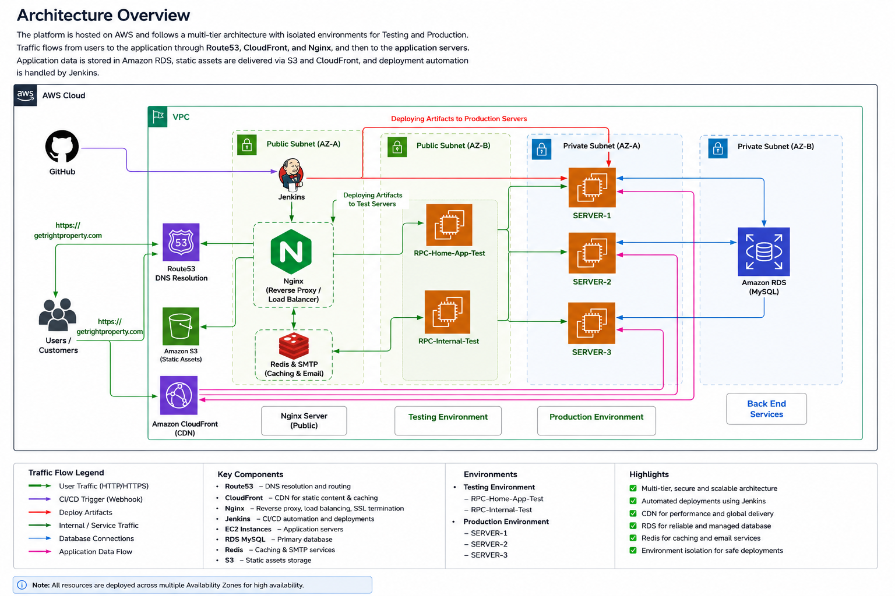

# Cloud Architecture

## Overview

The cloud platform was designed to provide a secure, scalable, maintainable, and highly available infrastructure capable of supporting enterprise web applications across multiple environments.

The architecture leveraged Amazon Web Services (AWS) to deliver cloud-native infrastructure while enabling continuous application delivery, simplified operations, centralized management, and improved system reliability.

The platform was designed with modular infrastructure components so that application services, databases, networking, security, and deployment pipelines could evolve independently while maintaining operational stability.

---

# Architecture Objectives

The primary objectives of the cloud architecture were:

- Build a reliable production platform
- Support multiple deployment environments
- Enable continuous software delivery
- Improve infrastructure scalability
- Reduce manual operational effort
- Secure internet-facing services
- Simplify infrastructure management
- Improve deployment consistency
- Centralize infrastructure documentation
- Support future platform growth

---

# Architecture Design Principles

The cloud platform was designed around several engineering principles.

## Security First

Security was considered throughout the infrastructure design.

Key security measures included:

- IAM-based access management
- Security Groups
- SSL/TLS encryption
- Reverse proxy configuration
- Controlled inbound traffic
- Secure DNS management
- Principle of least privilege
- HTTPS enforcement

---

## High Availability

The production platform was designed to minimize downtime through reliable cloud infrastructure and operational best practices.

Key considerations included:

- Managed cloud services
- Reliable DNS routing
- CDN integration
- Automated SSL renewal
- Infrastructure monitoring
- Operational documentation
- Backup support

---

## Scalability

The infrastructure was designed so that application components could scale independently as business requirements evolved.

Scalability considerations included:

- CloudFront content delivery
- Stateless application servers
- Independent database layer
- Object storage using Amazon S3
- Modular application deployment

---

## Maintainability

Long-term maintainability was a key architectural objective.

This was achieved through:

- Standardized deployment procedures
- Infrastructure documentation
- Version-controlled configurations
- Repeatable deployment workflows
- Environment separation
- Operational runbooks

---

# High-Level Architecture

The production platform consisted of multiple interconnected AWS services working together to deliver enterprise applications.

```
                    Internet
                        │
                        ▼
                  Amazon Route53
                        │
                        ▼
                  Amazon CloudFront
                        │
                        ▼
                    NGINX Reverse Proxy
                        │
        ┌───────────────┼───────────────┐
        ▼               ▼               ▼
   Web Application   API Services   Internal Services
        │               │
        └───────┬───────┘
                ▼
          Amazon RDS (MySQL)
                │
                ▼
             Redis Cache

                │
                ▼
          Amazon S3 Storage
```

> **Note:** This simplified architecture is intended to demonstrate the platform design. Specific implementation details have been generalized to protect confidential infrastructure information.

---

# AWS Services Used

## Amazon EC2

Amazon EC2 instances hosted the application services, reverse proxy, deployment components, and supporting infrastructure.

Responsibilities included:

- Application hosting
- API hosting
- Reverse proxy
- Linux administration
- Deployment targets

---

## Amazon Route 53

Amazon Route 53 was used for DNS management and domain routing.

Responsibilities included:

- Domain management
- DNS records
- Subdomain routing
- Production traffic routing

---

## Amazon CloudFront

CloudFront provided global content delivery for static assets and improved application performance.

Benefits included:

- Lower latency
- Content caching
- Reduced server load
- Improved user experience

---

## Amazon S3

Amazon S3 was used for object storage.

Typical use cases included:

- Static assets
- File storage
- Application resources
- Backup support

---

## Amazon RDS

Amazon RDS provided managed relational database services.

Benefits included:

- Managed backups
- Database reliability
- Simplified administration
- Improved availability

---

## AWS IAM

IAM controlled access to cloud resources.

Responsibilities included:

- User permissions
- Role management
- Secure access
- Resource authorization

---

# Networking

The networking architecture focused on secure communication between infrastructure components.

Key networking features included:

- DNS management
- Reverse proxy routing
- HTTPS communication
- Controlled inbound traffic
- Internal service communication
- CloudFront integration

---

# Reverse Proxy Architecture

NGINX acted as the central reverse proxy.

Responsibilities included:

- HTTPS termination
- SSL management
- Request routing
- Load distribution
- Static content serving
- Application routing

---

# Database Layer

The database layer was separated from the application layer to improve maintainability and security.

Primary database technologies included:

- Amazon RDS (MySQL)
- Redis

This separation allowed application services to scale independently from database services.

---

# Storage Layer

Persistent object storage was provided through Amazon S3.

Typical storage included:

- Static assets
- Uploaded files
- Application resources
- Backup artifacts

---

# Security Architecture

Security was implemented at multiple layers.

Infrastructure Security

- IAM
- Security Groups
- Least Privilege Access
- Secure SSH Access

Network Security

- HTTPS
- SSL/TLS
- Reverse Proxy
- DNS Security

Application Security

- Environment Separation
- Controlled Deployments
- Secure Configuration
- Operational Documentation

---

# Production Environments

The infrastructure supported multiple environments throughout the software development lifecycle.

These environments included:

- Production
- Testing
- Internal Services

Environment isolation reduced deployment risk while improving software quality.

---

# Design Decisions

Several architectural decisions contributed to the long-term success of the platform.

## Managed Cloud Services

Managed AWS services reduced operational overhead while improving platform reliability.

---

## Reverse Proxy

NGINX centralized request routing, SSL management, and application exposure.

---

## CDN Integration

CloudFront improved performance by caching static content closer to end users.

---

## Documentation

Infrastructure documentation became an essential operational asset.

Standardized documentation improved:

- Knowledge sharing
- Incident response
- Deployment consistency
- Platform maintenance

---

# Architecture Benefits

The resulting architecture provided:

- Improved scalability
- Better security
- Reliable deployments
- Simplified maintenance
- Centralized documentation
- Faster operational support
- Better production visibility
- Easier troubleshooting
- Improved platform stability

---

# Lessons Learned

Several important engineering lessons emerged while operating this platform.

- Architecture should prioritize simplicity.
- Documentation is as important as automation.
- Infrastructure changes should always be repeatable.
- Security should be integrated into every layer.
- Production systems require continuous monitoring.
- Operational consistency reduces deployment failures.
- Cloud architecture evolves continuously and should be designed for change.

---

# Summary

The cloud architecture successfully supported a real-world enterprise application by combining AWS managed services, secure networking, deployment automation, operational best practices, and comprehensive documentation.

Rather than focusing only on cloud infrastructure, the architecture emphasized reliability, maintainability, scalability, and long-term operational excellence.

This case study reflects practical experience gained through designing, operating, documenting, and continuously improving a production cloud platform over an extended period.

